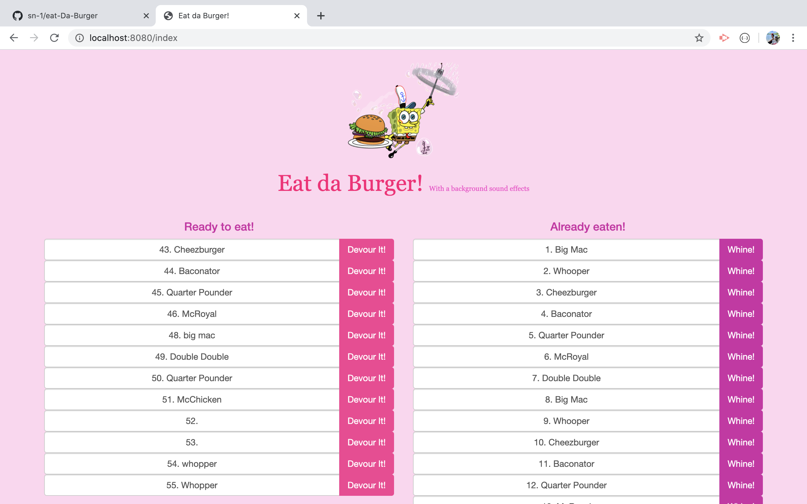

# :hamburger: Eat-Da-Burger! :hamburger:

 Eat-Da-Burger! is a restaurant app that lets users input the names of burgers they'd like to eat. Whenever a user submits a burger's name, the app will display the burger on the left side of the page -- waiting to be devoured. Each burger in the waiting area also has a Devour it! button. When the user clicks it, the burger will move to the right side of the page. The app will store every burger in a database, whether devoured or not.

## But the sad part is you can't order :x:

# :fries: or :pizza:

### Languages/Technologies
* MySQL
* Node.JS
* Express.JS
* Handlebars

### Functionality
Using an home-grown ORM, the app has 3 basic CRUD functions...
  1. READ all entries from the MySQL database and display them to the DOM using Handlebars.
  2. UPDATE a selected burger by clicking "Devour It"
  3. CREATE a new burger using the "Place Order" form 

### demo

  * 

  
### demo

  * 

 Really love making this app

## Authors
[GitHub](https://github.com/sn-1)

### Heroku
Please check out the launched app on Heroku [here](https://eat-da-burger-nawrin.herokuapp.com)! 
### :simple_smile:
### /play greatjob
